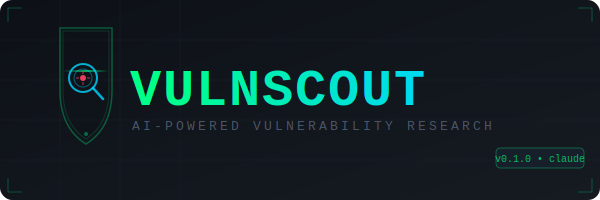

# VulnScout

AI-powered vulnerability scanner using Claude in an agentic loop. Two modes:
- **Repo mode** -- clone a git repo or point at local source, static analysis + optional crash verification
- **Webapp mode** -- crawl a web app, Claude generates HTTP test cases, verifier runs them live

This is the same methodology Anthropic used to find 22 CVEs in Firefox: Claude reasons about code paths and generates targeted test inputs, a verifier confirms them, results feed back to Claude for deeper analysis.


---

## Setup

```bash
git clone <this repo>
cd vulnscout
pip install -r requirements.txt
cp .env.example .env   # fill in your keys
python check.py        # verify everything before your first hunt
```

---

## Usage

### Repo scanning

```bash
# Scan a public repo (static analysis, no binary needed)
python main.py repo https://github.com/nicowillis/libpng

# Scan with language filter
python main.py repo https://github.com/org/project --language python

# Focus on a specific subsystem
python main.py repo https://github.com/org/project --focus auth

# Scan local directory
python main.py repo ./path/to/source --language c_cpp

# With binary harness for crash confirmation (see below)
python main.py repo https://github.com/org/project --binary ./target_asan

# Emit submission-ready files for a bounty platform (repeatable)
python main.py repo https://github.com/org/project -P hackerone -P bugcrowd

# Force a full rescan, ignoring cross-session memory
python main.py repo https://github.com/org/project --no-memory
```

### Web app scanning

```bash
# Unauthenticated scan
python main.py webapp https://target.example.com

# Authenticated with bearer token
python main.py webapp https://api.example.com --auth-token eyJhbGci...

# Authenticated with session cookie (grab from browser devtools → Network → copy cookie header)
python main.py webapp https://app.example.com --cookie "session=abc123; csrf=xyz789"

# With custom headers
python main.py webapp https://app.example.com -H "X-Api-Key: key123" -H "X-Tenant: acme"

# Limit crawl depth (faster, less coverage)
python main.py webapp https://app.example.com --max-pages 30 --iterations 10

# Emit submission-ready files for a bounty platform
python main.py webapp https://app.example.com --platform intigriti
```

---

## Bug bounty workflow

VulnScout doesn't stop at "found a bug." Confirmed findings flow through a
submission pipeline so they come out ready to file and get paid.

### 1. Independent verifier (always on)

Every PoC is reviewed by a second, fresh Claude call whose only job is to
*disprove* the finding — looking for upstream sanitization, auth gates, runtime
mitigations, or unreachable paths. Only findings it can't disprove proceed to
binary/HTTP verification. This is the core false-positive filter and runs on
every scan automatically.

### 2. Chain / escalation analysis

When a finding is confirmed, VulnScout runs a chaining pass that reasons about
what the bug *enables* — IDOR → account takeover, SSRF → cloud metadata →
credential theft, a memory primitive → code execution. If the chain points to a
concrete next target, it's fed back into the live loop so VulnScout pursues the
escalation in the same session. The result is recorded under **Chain /
Escalation** in the report.

### 3. Validation gate

Before reporting, each finding goes through a 7-question quality gate modelled on
real bounty triage (reproducible? impact concrete? asset precise? severity
justified? remediation clear?). The gate *annotates* — it never drops findings —
attaching a `score/7` checklist to the report so weak write-ups are obvious
before you spend a submission slot.

### 4. Platform-specific submissions

Pass `--platform` / `-P` (repeatable) on any `repo`, `webapp`, or `hunt` command
to emit a submission-ready markdown file per finding, formatted for the target
platform:

| Platform | Flag value(s) |
|---|---|
| HackerOne | `hackerone` or `h1` |
| Bugcrowd | `bugcrowd` |
| Intigriti | `intigriti` |

Each file includes the platform's expected sections (summary, severity band /
priority, steps to reproduce, PoC, impact, remediation) plus the chain and
validation gate results.

```bash
python main.py hunt "topic:parser" --language c -P hackerone -P bugcrowd
```

### 5. Cross-session memory

VulnScout remembers what it has scanned in `~/.vulnscout/memory.json`:

- **Repo mode** — if a repo's HEAD commit is unchanged since the last scan, it's
  skipped (great for `hunt` over a large set on a schedule).
- **All modes** — confirmed findings are fingerprinted, so the same bug isn't
  re-reported across runs. Only *new* findings make it into the report.

Use `--no-memory` to force a full rescan and re-report everything.

---

## Hard crash verification (repo mode)

Static mode trusts Claude's analysis but can't confirm crashes. For memory-unsafe languages (C/C++, Rust unsafe), build with AddressSanitizer for real confirmation:

```bash
# For a C/C++ project with make
CC=clang CFLAGS="-fsanitize=address,undefined -g -O1" \
CXX=clang++ CXXFLAGS="-fsanitize=address,undefined -g -O1" \
make -j$(nproc)

# Copy the binary and pass it to vulnscout
cp ./build/your_binary ./target_asan
python main.py repo ./source --binary ./target_asan

# For CMake projects
cmake -DCMAKE_C_COMPILER=clang \
      -DCMAKE_CXX_COMPILER=clang++ \
      -DCMAKE_C_FLAGS="-fsanitize=address,undefined -g -O1" \
      -DCMAKE_CXX_FLAGS="-fsanitize=address,undefined -g -O1" \
      -B build && cmake --build build -j$(nproc)
```

The binary must accept input from stdin. If it takes a filename instead, modify `build_harness_verifier` in `scanner/repo_scanner.py` to write Claude's input to a temp file and pass that path.

---

## Understanding the output

Reports land in `./findings/` (or wherever `--output` points):

- `vulnscout_repo_<target>_<timestamp>.md` -- human-readable report with analysis, PoCs, chain/escalation, validation gate, and disclosure notes
- `vulnscout_repo_<target>_<timestamp>.json` -- structured data for further processing
- `vulnscout_repo_<target>_<timestamp>_<platform>_finding<N>.md` -- one submission-ready file per finding, when `--platform` is used

**Important:** confirmed findings in static mode mean Claude produced a concrete, specific hypothesis. They still need manual validation before filing. Confirmed findings in binary/HTTP mode have been automatically verified.

---

## Tips for getting real CVEs

**Pick the right target**
- Small to mid-size C/C++ libraries with active maintenance (they'll actually assign a CVE)
- Projects with a `SECURITY.md` or published CVD policy
- Avoid browser engines and crypto libs -- too well-audited, too complex
- Good hunting grounds: image parsers, network protocol parsers, compression libs, auth libraries

**Web app targets**
- Your own apps (always fine)
- Bug bounty programs on HackerOne or Bugcrowd with defined scope
- Open source web apps you can run locally

**For IAM-specific findings**
- OAuth library implementations
- SAML parsers
- JWT validation logic
- LDAP query construction (injection)

**Filing a CVE**
1. Reproduce manually in your own environment
2. Contact the maintainer privately via their security email or security.md
3. Give them 90 days (standard coordinated disclosure window)
4. After patch ships, request CVE via https://cveform.mitre.org/ 
5. Reference the fix commit and your disclosure timeline

---

## Cost expectations

- Repo scan (static, 1-2 chunks): ~$0.50-2.00 per session with Opus
- Repo scan (large codebase, many chunks): $5-20
- Webapp scan: ~$1-5 depending on iteration count

Anthropic's Firefox work cost ~$4k but that was exploit development, not just finding. Finding is significantly cheaper.

---

## Limitations

- **Static mode** can't confirm crashes -- it records Claude's analysis but verification requires a build
- **Web app mode** uses heuristics to detect confirmed findings -- some true positives need manual review
- **Context window** limits how much code fits in one chunk -- large codebases get chunked, which means cross-file vulnerabilities may be missed
- **Rate limiting** -- if you hit API limits, add a `time.sleep()` between iterations in `claude_loop.py`
- This is a research tool, not a product. Treat output as leads to investigate, not proof

---

## Legal

Only use on targets you own or have explicit written authorization to test. 
The web scanner includes an authorization prompt that must be confirmed before scanning.

---

## MCP Server — Control VulnScout from Claude.ai

The MCP server (`mcp_server.py`) lets you start, monitor, and read findings from VulnScout directly in the Claude.ai chat window. It runs on your Kali VPS and exposes 8 tools.

### Setup on Kali VPS

```bash
# Install dependencies
cd /home/kali/vulnscout
pip install -r requirements.txt

# Copy and fill in your keys
cp .env.example .env
# Edit .env — set ANTHROPIC_API_KEY and GITHUB_TOKEN

# Install and start the systemd service
sudo cp vulnscout-mcp.service /etc/systemd/system/
sudo systemctl daemon-reload
sudo systemctl enable vulnscout-mcp
sudo systemctl start vulnscout-mcp

# Verify it's running
sudo systemctl status vulnscout-mcp
```

### Environment variables

The service reads from `/home/kali/vulnscout/.env`. Both keys are required:

| Variable | Description | Where to get it |
|---|---|---|
| `ANTHROPIC_API_KEY` | Claude API key | console.anthropic.com |
| `GITHUB_TOKEN` | GitHub PAT (read-only) | github.com/settings/tokens — scope: `public_repo` |

> The service runs in an isolated environment — exporting variables in your shell won't work. They must be in `.env`.

### Connect to Claude.ai

1. Start the service (above)
2. In Claude.ai → Settings → Integrations → Add custom integration
3. URL: `http://YOUR_VPS_IP:8000/mcp`
4. Name: VulnScout

Once connected, the 8 tools below are available in any Claude.ai conversation.

### MCP Tools Reference

| Tool | What it does |
|---|---|
| `vulnscout_start_hunt` | Search GitHub for repos matching a query, scan up to 30, save findings |
| `vulnscout_start_repo_scan` | Scan a single repo URL or local path |
| `vulnscout_start_webapp` | Crawl a web app, generate and run HTTP test cases |
| `vulnscout_get_status` | List all running and completed jobs with PIDs and start times |
| `vulnscout_get_log` | Tail the log for a job (default 50 lines, up to 200) |
| `vulnscout_stop_scan` | Stop a running job by job_id (findings saved so far are preserved) |
| `vulnscout_list_findings` | List all finding reports in the findings directory |
| `vulnscout_get_finding` | Read the full content of a finding report |

### Example Claude.ai workflow

Start a hunt from the chat window:
> "Start a VulnScout hunt for C network protocol parsers, max 10 repos, focus on decode"

Check progress:
> "What's the status on the VulnScout hunt?"
> "Show me the last 100 lines of the hunt log"

Review findings:
> "List VulnScout findings" → "Read the libfoo finding report"

Stop if needed:
> "Stop the VulnScout scan with job_id 20260502_143022"

### Firewall note

The MCP server binds to `0.0.0.0:8000` by default. If your VPS has a firewall, allow port 8000 from your IP only:

```bash
sudo ufw allow from YOUR_HOME_IP to any port 8000
```

Or use a private tunnel (Tailscale, Cloudflare Tunnel) for zero-exposure access.

---

## Troubleshooting

Common errors encountered during setup and how to fix them, in the order you're likely to hit them.

---

### 1. GitHub 401 Unauthorized

**Symptom:**
```
GitHub search failed: 401 Client Error: Unauthorized
```

**Cause:** No GitHub token configured, or the token is invalid.

**Fix:**
```bash
echo 'GITHUB_TOKEN=ghp_yourTokenHere' >> /home/kali/vulnscout/.env
sudo systemctl restart vulnscout-mcp
```

Get a token at https://github.com/settings/tokens — minimum scope is `public_repo` (read-only).

---

### 2. Anthropic API Key Not Set

**Symptom:**
```
Error: ANTHROPIC_API_KEY not set.
Export it: export ANTHROPIC_API_KEY=sk-ant-...
```

**Cause:** The key is missing from the environment VulnScout runs in.

> **Important:** Exporting the key in your shell (`export ANTHROPIC_API_KEY=...`) does NOT work — VulnScout runs as a systemd service with its own isolated environment. The key must be in `.env`.

**Fix:**
```bash
cat > /home/kali/vulnscout/.env << 'EOF'
ANTHROPIC_API_KEY=sk-ant-api03-yourKeyHere
GITHUB_TOKEN=ghp_yourTokenHere
EOF

sudo systemctl restart vulnscout-mcp
```

**Verify the key loaded:**
```bash
sudo systemctl show vulnscout-mcp | grep ANTHROPIC
```

You should see the full key echoed back. If the output is blank, see the next section.

---

### 3. Environment Variables Not Loading

**Symptom:**
```bash
sudo systemctl show vulnscout-mcp | grep ANTHROPIC
# (blank output)
```

**Cause:** The service file has malformed `Environment=` lines — typically missing closing quotes or commented-out entries.

**Fix — rewrite the service file using `tee`:**
```bash
sudo tee /etc/systemd/system/vulnscout-mcp.service << 'EOF'
[Unit]
Description=VulnScout MCP Server
After=network.target

[Service]
Type=simple
User=kali
WorkingDirectory=/home/kali/vulnscout
EnvironmentFile=/home/kali/vulnscout/.env
Environment="VULNSCOUT_DIR=/home/kali/vulnscout"
ExecStart=/home/kali/vulnscout/.venv/bin/python /home/kali/vulnscout/mcp_server.py --port 8000
Restart=on-failure
RestartSec=10

[Install]
WantedBy=multi-user.target
EOF

sudo systemctl daemon-reload
sudo systemctl restart vulnscout-mcp
sudo systemctl show vulnscout-mcp | grep ANTHROPIC
```

---

### 4. Permission Denied on Logs or Findings

**Symptom:**
```
[Errno 13] Permission denied: '/home/kali/vulnscout/logs/hunt_XXXXXXXX.log'
```

**Cause:** Earlier runs as root created `logs/` and `findings/` owned by root, but the service runs as `kali`.

**Fix:**
```bash
sudo chown -R kali:kali /home/kali/vulnscout/logs
sudo chown -R kali:kali /home/kali/vulnscout/findings
```

---

### Monitoring a Running Hunt

You don't need the MCP interface to check progress. From the VPS directly:

```bash
# Stream the live log
tail -f /home/kali/vulnscout/logs/hunt_JOBID.log

# Check what findings have been saved
ls -lh /home/kali/vulnscout/findings/
```

---

### Tip: Use `tee` and `sed` Instead of `nano`

When editing config files on a headless VPS, `tee` and `sed` are more reliable than interactive editors.

**Write a file:**
```bash
cat > /home/kali/vulnscout/.env << 'EOF'
ANTHROPIC_API_KEY=sk-ant-...
GITHUB_TOKEN=ghp_...
EOF
```

**Edit a single value in-place:**
```bash
sed -i 's|^ANTHROPIC_API_KEY=.*|ANTHROPIC_API_KEY=sk-ant-newKeyHere|' /home/kali/vulnscout/.env
```
